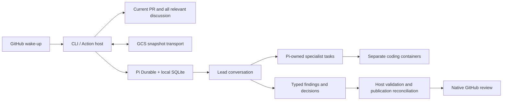

# Architecture

The host enforces identity, capabilities, persistence, finding contracts and GitHub publication. The lead makes review judgments: applicability, full versus targeted scope, validation, duplicate identity, dispositions and conclusions. This division keeps subjective review decisions agent-driven without handing credentials or publication authority to shell tools.

## Pi ownership

One stable numeric repository ID and PR number identifies a session across head revisions and repository renames. The root conversation is the lead. A sequential `investigate` tool admits a bounded batch of task-owned specialist conversations; Pi handles admissions, completion, cancellation and recovery. Follow-up investigation forks existing history into a current owner. The host does not maintain a second scheduler, queue or conversation log.

`ReviewDoc` records identity, revision context, scope, selections, candidates and decisions, accepted findings, imported source versions, publication intent/results, reviewed revisions and artifact references. `InvestigationDoc` records workspace identity, enabled capabilities and structured reports. Pi stores conversation configuration, task state, transcripts, request IDs, compaction and measured usage. Persistent documents use typed versioned definitions. Public output contains evidence and conclusions, never raw transcripts or private reasoning.

Executable extensions, MCP clients, environment variables, credentials, processes and checkout files are not SQLite state. The host rebuilds these before any resumed model/tool work. Incompatible Pi/MCP versions fail visibly. Changed trusted configuration or comparison revisions abort pending owned work and begin a deliberate review handoff while retaining earlier findings and publication receipts. Missing required artifacts also force a fresh investigation. Interrupted shell calls are never treated as live processes.

## Trusted configuration and tools

The runner fetches an explicit trusted SHA for configuration and profiles. Shared profiles require another explicit repository/SHA. Local profiles override shared ones by stable name; only explicitly selected profiles are loaded. AGENTS.md is scoped instruction text from the investigated checkout, not a runtime permission schema.

Every specialist gets its configured model/reasoning level, instruction set and isolated workspace. The lead initially receives a catalogue of names/descriptions. Optional globs are hints; there is no hard-coded fixed panel. Full coding tools operate through Pi's execution environment in a separate container. Only that investigator's checkout is writable. No host credentials, home directory or Docker socket cross the boundary. Source exports read exact tree/blob contents, ignoring export-ignore/export-subst archive attributes, and contain no Git administration directory or configured push remote. Submodules and Git LFS pointers create explicit coverage gaps. Operational Git code has only init/fetch/read operations.

Approved stdio/HTTPS MCP definitions are connected by the host. `enable_capability` can only select an already approved group. Pi's `configure` changes the offered tools for the next prepared request; a running request retains its prior offer. Saved capability names are reconstructed from registered implementations after restart. Model-facing tools must declare read-only behavior and have explicit tool/method allowlists. GitHub calls additionally validate repository/PR, linked issue and owned thread scope. No model-facing GitHub write tools exist.

The model-facing GitHub connection uses a distinct read-only token and server `--read-only`. The host's operational connection uses the bot's publication token for both writes and authoritative reconciliation. This is necessary because private pending reviews are visible to their creator. Provider keys and Google ADC stay in the host as well. MCP credential references are resolved at connection time; resolved values are redacted from MCP output and excluded from artifacts.

## SQLite snapshots and investigation artifacts

`SnapshotStore` has just `read(key)` and guarded `write(key, data, generation)`. Local and GCS implementations carry bytes; Pi's SQLite backend remains unmodified. GCS metadata determines the generation, and the download addresses that exact version. A new save requires generation zero; a replacement requires the downloaded generation. Retries retain that guard. Upload operation IDs and digests reconcile an accepted upload whose response was lost.

The lifecycle is restore, validate, open, reconstruct, run, stop/abort processes, capture/upload changed investigation files, record their references, close, backup/validate, upload. SQLite's backup API includes committed WAL pages; the standalone destination uses DELETE journal mode. It is never just the live main file copied while WAL pages are outstanding. A failed replacement preserves the prior object. A failed artifact upload prevents publishing a database that would refer to unavailable files.

Artifacts compare actual filesystem contents against the exact head export, so shell edits count as well as Pi write/edit calls. They preserve file bytes, modes, symlinks and deletions; dependencies, caches, credentials and unrelated runner files are excluded. Each artifact includes version, head/base commit, specialist/workspace identity and digest. Restoration verifies all identities and prevents symlink traversal. Excluded dependencies can be regenerated; missing required evidence triggers explicit investigation restart.

## GitHub publication

The engine first reads the current PR metadata, exact base/head/merge-base comparison, reviews, complete inline threads, conversation comments and relevant human replies. MCP supplies most context; narrow REST reads supplement numeric comment IDs, replies beyond the pinned server's 100-comment thread cap, pending review comments, exact repository identity and merge-base comparison.

Structured candidates contain provenance, category, title, explanation, revision/path/range/side, concrete evidence, impact, priority, confidence and optional complete replacement. The lead records decisions and underlying issue identity. Host checks enforce evidence presence, publication anchors and configured policy. A failed specialist is a coverage gap, even if later skipped; rerunning it successfully removes that failure. Rechecking fixed feedback requires matching a quote against the immutable current checkout or verifying deletion. Permission lookups gate explicit maintainer dismissals.

Publication records intent before a write. Batch/finding/reply markers and returned GitHub IDs reconcile results after every operation. A successful transport response alone is insufficient. The next run can recover public findings from inline metadata and compressed review metadata, including summary-only/deferred findings. Recovered feedback requires fresh investigation; outdated or resolved markers do not prove a fix. Dismissal source/reason survives recovery.

A pending review is created, expected inline comments are reconciled/added, and the native verdict is submitted. Lost responses trigger readback rather than blind retry. Obsolete Sift-owned pending batches can be replaced after their findings have been imported. Invalid anchors are reported with exact code links in the summary. Limits disclose every deferred finding and never erase blockers. Current base/head are checked before each stage and after submission. GitHub cannot make the final revision check and review write atomic; a detected post-write race is reported as stale, never a confirmed approval.
