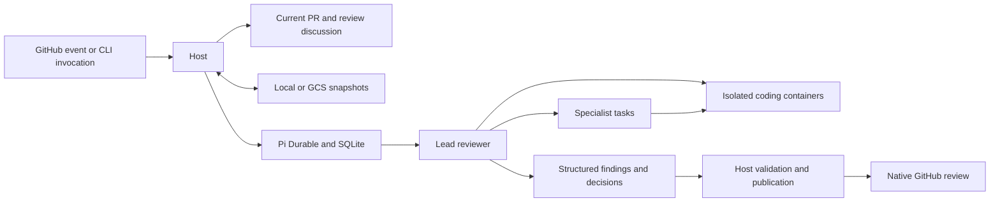

# Architecture

Sift runs a lead reviewer and selected specialists through Pi Durable. The agents make review judgments; the host validates their structured results, owns credentials and reconciles GitHub publication. The [CLI and GitHub Action](../README.md) use the same review engine.

## Runtime ownership

A numeric repository ID and PR number identify one durable session across pushes and repository renames. The root conversation is the lead. It selects or skips each configured specialist, chooses a full or targeted review and starts bounded investigation batches. Pi owns child conversations, task admission, completion, cancellation and recovery. Follow-up investigations retain specialist history in a newly owned task.

`ReviewDoc` stores review scope, candidates, decisions, outstanding findings, imported discussion, coverage, publication receipts and artifact references. `InvestigationDoc` stores each conversation's workspace, enabled capabilities and report. Pi stores transcripts, conversation configuration, task state, request IDs, compaction and measured usage in SQLite.

Before resuming model or tool work, the host rebuilds executable extensions, MCP connections and workspaces. These resources, credentials and shell processes are not SQLite state. A changed comparison revision or trusted configuration deliberately restarts review work while retaining feedback and publication receipts. Missing required artifacts also trigger a fresh investigation. Incompatible saved runtime versions fail visibly.

## Trust and tool boundaries

Configuration and local profiles come from an explicit trusted commit. Shared profiles require a repository and full commit SHA; local profiles override shared profiles by name. Only selected profiles are loaded. Root and nested `AGENTS.md` files provide directory-scoped instructions from the reviewed checkout; they do not grant runtime permissions. See [configuration](configuration.md) and [profiles and runtime](profiles-and-runtime.md).

The lead and specialists use separate containers for coding tools. Each receives its configured model, reasoning level, instructions and workspace. Containers can edit their workspace and run commands, but receive no host credentials, home directory or Docker socket. Sift mounts its worker and dependencies read-only, runs with the runner's user and group IDs, and applies command timeouts and container resource limits. Containers have network access, so this execution model is intended for trusted repositories and internal branch PRs. External forks are skipped.

Source exports read exact Git tree and blob contents, preserving files regardless of archive attributes. Investigations receive no `.git` directory or configured push remote. Submodules and Git LFS pointers produce explicit coverage gaps.

The host connects approved stdio or HTTPS MCP servers and enforces tool and method allowlists. Model-facing tools must advertise read-only behavior. `enable_capability` activates an approved group for the next model request; saved selections are reconstructed after restart. GitHub calls also enforce repository, PR, linked-issue and owned-thread scope.

The model-facing GitHub server runs with `--read-only` and a distinct read token. The host uses the publication identity for writes and reconciliation, including private pending reviews visible only to their creator. Model credentials and Google application default credentials remain in the host. MCP credential references are resolved at connection time and redacted from tool results.

## Snapshot and artifact recovery

`SnapshotStore` transports bytes through guarded reads and writes; Pi keeps its SQLite backend. Local storage uses a content hash and an atomic replacement. GCS reads the exact object generation returned by metadata and writes with that generation as a precondition. First saves use generation zero. Retries retain the guard, and operation IDs plus content digests reconcile uploads whose responses were lost.

At shutdown, the host aborts Pi work and stops containers before capturing changed investigation files. It uploads these artifacts, records their references, closes Pi, creates and validates a standalone SQLite backup, then uploads the database. SQLite's backup API includes committed WAL pages; copying only the live main file would not be sufficient. A failed artifact upload prevents saving a database that references unavailable files.

Artifacts include shell edits, reproduction files, modes, symlinks and deletions. Dependencies, caches and credential paths are excluded; capture refuses files containing known secrets or recognized private keys and GitHub tokens. Restoration verifies the revision, workspace identity and digest, and refuses symlink traversal. Dependencies and caches can be regenerated; shell processes cannot be resumed. Ordinary execution failures still attempt persistence. Abrupt runner loss can lose progress since the last completed snapshot. See [operations](operations.md) for recovery procedures.

## Review and publication

Each run fetches the current PR, exact base/head/merge-base comparison, reviews and relevant discussion. GitHub MCP provides context, with REST reads supplementing repository identity, merge-base comparison, numeric comment IDs, pending review comments and replies beyond the MCP thread limit.

Specialists submit typed findings with locations, evidence, impact, priority and confidence. The lead validates claims, merges duplicates by underlying issue and records rejection reasons. Failed investigations remain coverage gaps until successfully retried or covered by another completed investigator. Existing findings require evidence from the immutable current checkout before their threads can be resolved. Maintainer dismissals require a verified permission lookup and imported source message.

The host records intent before writing to GitHub. Stable batch, finding and reply markers, together with GitHub IDs, allow readback after each operation and recovery after local state loss. Lost responses are reconciled before retrying. Recovered feedback needs fresh investigation; an outdated or resolved thread alone does not prove a fix.

Publication creates a pending review, reconciles expected inline comments and submits `APPROVE`, `REQUEST_CHANGES` or `COMMENT` according to policy. Invalid anchors remain in the summary with exact code links; comment limits disclose deferred findings and preserve blockers. Only Sift-owned threads can be resolved or reopened. Public output contains evidence and conclusions, not transcripts or private reasoning.

The host checks current base and head revisions throughout publication and after submission. GitHub cannot make the final revision check and write atomic: a detected race is reported as stale. Dry-run performs the review and persists its plan without GitHub mutations. Automated coverage and its external-service limits are described in [testing](testing.md).
